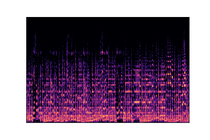
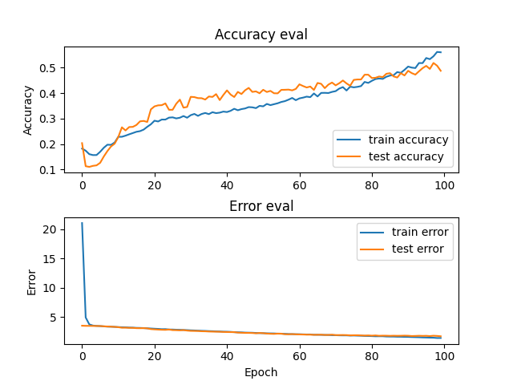
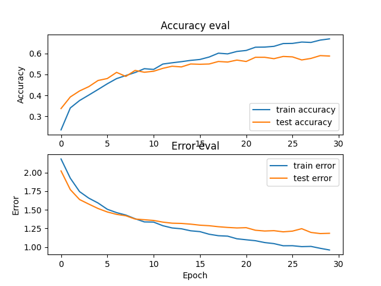

## Dataset

GTZAN Dataset - Music Genre Classification  
Audio Files | Mel Spectrograms | CSV with extracted features  
https://www.kaggle.com/datasets/andradaolteanu/gtzan-dataset-music-genre-classification?sort=votes

### Mel Spectogram 
* blues00002  
 



## Solving Overfitting
```python
# 커널 정규화
tf.keras.layers.Dense(512, activation='relu', kernel_regularizer=tf.keras.regularizers.l2(0.001)),
tf.keras.layers.Dropout(0.3)
```
https://www.tensorflow.org/api_docs/python/tf/keras/regularizers/Regularizer  

### Plotting

#### solving overfitting


#### RNN-LSTM



## MLflow
https://github.com/amesar/mlflow-examples


